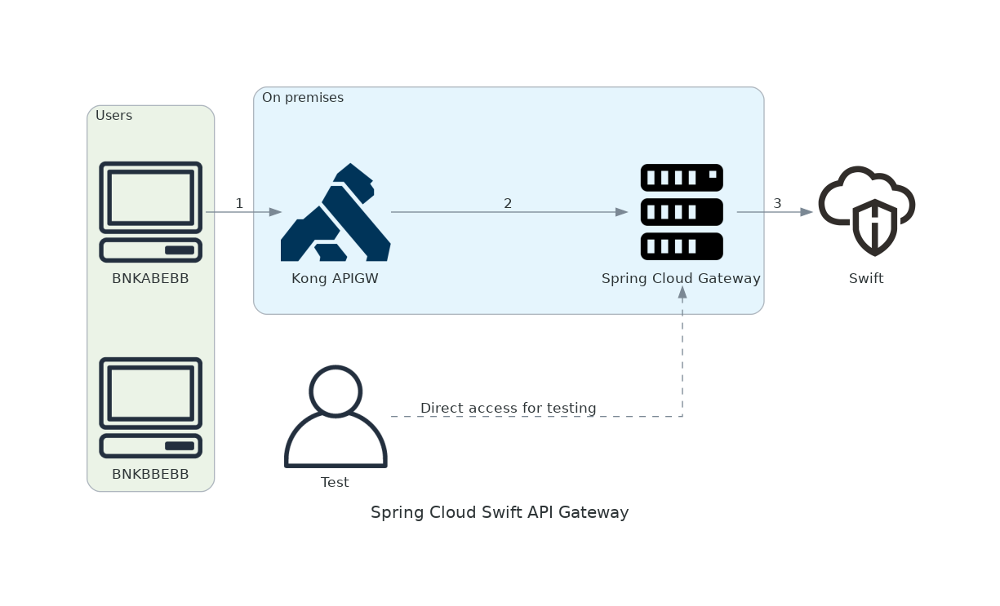

[](https://github.com/ikermendi/cecabank-demo/actions/workflows/main.yaml)

# Swift API Gateway using Spring Cloud Gateway

This project is a simple example of how to use [Spring Cloud Gateway](https://docs.spring.io/spring-cloud-gateway/reference/) to create an API Gateway for Swift APIs.

## Overview



Three main components are used in the application:

1. **Users**: The user is the entity that uses the APIs. The user is identified by an API key and once the it is authenticated, the API Gateway sets the `X-Customer-Custom-ID` header to the appropriate value. This header contains the `BIC` of the user.

2. **Kong API Gateway**: The Kong API Gateway is the entry point for all the APIs. It is responsible for routing the requests to the appropriate services. The API Gateway handles the authentication and authorization of the requests and sets the `X-Customer-Custom-ID` header to the appropriate value. Once the request is authenticated and authorized, Kong API Gateway forwards the request to the **Spring Cloud Swift API gateway**.

3. **Spring Cloud Swift API Gateway**: The Spring Cloud Swift API Gateway is responsible for routing the requests to the appropriate Swift API. The application identifies the user using the `X-Customer-Custom-ID` header set by the Kong API Gateway. This identifications is done using a custom `Principal` implementation but [any other authentication mechanism from Spring Security can be used.](https://docs.spring.io/spring-security/reference/servlet/authentication/index.html)


## Running the application

### Before you begin
The project is ready to use with the Swift Sandbox environment. The only thing you need to do is to create an account on the Swift Developer Portal and create an application to get the client ID and client secret.

1. Create an account on the [Swift Developer Portal](https://developer.swift.com)

2. Create an application on the [Swift Developer Portal](https://developer.swift.com/apps) and select **Pre-Validation API** and **GPI Tracker API** options.

3. Get the `Consumer Key` and `Consumer Secret` from the application you created.

4. Copy `.env` file to `.env.local` and fill in the values.

### Launching the application using Docker

The application can be run using Docker. The following command shows how to run the application.

``` bash
docker-compose up
```

### Launching Spring Boot standalone for testing

The Spring Boot application can be launched standalone. When the application is launched standalone, the HTTP header `X-Consumer-Custom-ID` is manually set in the postman collection.

To run the application standalone, go to the swift-api-gateway directory of the project and start the application.

``` bash
cd swift-api-gateway
./mvnw spring-boot:run
```

## Testing 

A postman collection is provided for testing. The postman collection contains the following requests:
* Bank A - Pre-Validation API
* Bank B - Pre-Validation API
* Bank B - GPI Tracker API

The postman collection is located in the `postman` directory. You can import the collection into Postman and run the requests.

> **_NOTE:_**
For testing purposes, the Spring Cloud Swift API Gateway is also accessible directly.
The postman collection contains a `Direct` folder to test the Spring Cloud Swift API Gateway directly.
In this case, the `X-Consumer-Custom-ID` header must be set manually.


## Configuration

The configuration of the API Gateway is done using the `application.yml` file but Java configuration classes can be used as well.
For simplicity, all the configuration is but at the end of this document there are examples of how to configure the OAuth2 clients and the routes using Java configuration classes.

Three main configurations are required:
* Channel certificates
* OAuth2 clients
* Routes

> **_NOTE:_**
Please note that the **route id**, **channel certificate** and the **OAuth2 client** names are the same. The name is used to link all the configurations together.

### Routes

The route is the entry point for the requests. The route is matched based on the predicates and the request is processed by the filters. The filters are used to modify the request before it is sent to the Swift API. The routes are configured using the `spring.cloud.gateway.routes` property.

The following example shows how to configure a route for the Pre-Validation API.

``` yaml
spring:
  cloud:
    gateway:
      routes:
        - id: bnkbbebb-pre-validation
          uri: https://sandbox.swift.com
          predicates:
            - Path=/swift-preval/**
            - Header=X-Consumer-Custom-ID,bnkbbebb
          filters:
            - RemoveRequestHeader=X-Consumer-Custom-ID
            - AddRequestHeader=x-bic,swhqbebb
            - TokenRelay=bnkbbebb-pre-validation
```

In this case, two predicates are used to route the request to the Pre-Validation API:
1. `Path=/swift-preval/**`: The request must start with the path `/swift-preval/`.
2. `Header=X-Consumer-Custom-ID,bnkbbebb`: The request must have the header `X-Consumer-Custom-ID` with the value `bnkbbebb`.

The request is processed by four filters:
1. `RemoveRequestHeader=X-Consumer-Custom-ID`: The header `X-Consumer-Custom-ID` is removed from the request.
2. `AddRequestHeader=x-bic,swhqbebb`: The header `x-bic` is added to the request with the value `swhqbebb`.
4. `TokenRelay=bnkbbebb-pre-validation`: The OAuth2 token for the client `bnkbbebb-pre-validation` is added to the request.


### Channel certificates

The channel certificates are used to authenticate the API Gateway to the Swift APIs. The certificates are stored in the `src/main/resources/certificates` directory and configured using the `swift.channel-certificates` property.

One keystore is created for each customer and each keystore can contain multiple certificates. Depending on the Swift API, a different certificate is used.

The following example shows how to configure the channel certificates for customer with BIC `BNKBBEBB` with two certificates: one for the **Pre-Validation API** and the other one for the **GPI Tracker API**.

``` yaml
swift:
  channel-certificates:
    bnkbbebb-pre-validation:
      location: classpath:keystores/bnkabebb.jks
      alias: pre-validation
      password: Abcd1234
      key-password: Abcd1234
    bnkbbebb-gpi-tracker:
      location: classpath:keystores/bnkbbebb.jks
      alias: gpi-tracker
      password: Abcd1234
      key-password: Abcd1234
```

### OAuth2 clients

The OAuth2 clients are used to authenticate the API Gateway to the Swift APIs. The OAuth2 clients are configured using the `spring.security.oauth2.client.registration` property.

The following example shows how to configure a client for the Pre-Validation API.

``` yaml
spring:
  security:
    oauth2:
      client:
        registration:
          bnkbbebb-pre-validation:
            client-id: pzGGIkKTn6ftiMh1vjXRYwjV0PMdyqQY
            client-secret: 6Mn5AlnHzTRTSqZK
            client-authentication-method: basic
            authorization-grant-type: client_credentials
            scope: swift.preval!p
            provider: swift
        provider:
          swift:
            token-uri: https://sandbox.swift.com/oauth2/v1/token
```

### Using Java configuration classes

OAuth2 clients and routes can be configured using Java configuration classes.

The following example shows how to configure a OAuth2 client for the Pre-Validation API.

``` java
@Configuration
public class OAuth2ClientConfiguration {

  @Bean
  public ClientRegistrationRepository clientRegistrationRepository() {
    ClientRegistration registration = ClientRegistration
      .withRegistrationId("bnkbbebb-pre-validation")
      .authorizationGrantType(AuthorizationGrantType.JWT_BEARER)
      .clientId("pzGGIkKTn6ftiMh1vjXRYwjV0PMdyqQY")
      .clientSecret("6Mn5AlnHzTRTSqZK")
      .clientAuthenticationMethod(ClientAuthenticationMethod.CLIENT_SECRET_BASIC)
      .scope("swift.preval!p")
      .tokenUri("https://sandbox.swift.com/oauth2/v1/token")
      .build();
    return new InMemoryClientRegistrationRepository(List.of(registration));
  }
}
```

Routes can be also configured using Java configuration classes.

``` java
@Configuration
public class RoutesConfiguration {

  @Bean
  public RouteLocator fluentApiRoutes(RouteLocatorBuilder builder) {
    return builder.routes()
      // Pre-Validation
      .route("bnkbbebb-pre-validation",
        r -> r.path("/swift-preval/**").and().header("X-Consumer-Custom-ID", "bnkbbebb")
          .filters(f -> f.removeRequestHeader("X-Consumer-Custom-ID")
            .addRequestHeader("x-bic", "swhqbebb")
            .tokenRelay("bnkbbebb-pre-validation"))
          .uri("https://sandbox.swift.com"))

      // GPI tracker
      .route("bnkbbebb-gpi-tracker",
        r -> r.path("/gpi-tracker/**").and().header("X-Consumer-Custom-ID", "bnkbbebb")
          .filters(f -> f.removeRequestHeader("X-Consumer-Custom-ID")
            .rewritePath("/gpi-tracker/?(?<segment>.*)",
              "/swift-apitracker/v6/payments/$\\{segment}/transactions")
            .tokenRelay("bnkbbebb-gpi-tracker"))
          .uri("https://sandbox.swift.com"))
      .build();
  }
}
```
```